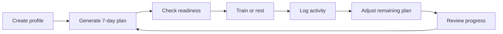

# PureAthletic V1 — Quick Product Summary

**Purpose:** A quick-reading summary of the product requirements, decisions, user flow, and low-fidelity wireframes.

## The product in one sentence

PureAthletic helps adult amateur football players decide what training is appropriate to do next by creating a seven-day plan that responds to their schedule, completed activity, readiness, and pain feedback.

## Who V1 is for

- Adults aged 18 or older
- Amateur football players
- Athletes who have fixed team practices or matches
- Athletes who also train independently
- People without regular access to a personal strength and conditioning coach

## The problem it solves

Amateur players often combine team training, matches, gym sessions, and running without knowing how those activities affect one another. A static workout plan cannot respond when the athlete is tired, misses a session, reports pain, or completes unexpected activity.

PureAthletic should answer:

> What is the most appropriate thing for me to do next?

## The core experience



## Main parts of the website

| Area | Purpose |
| --- | --- |
| Today | Show the athlete's next recommendation and why it is appropriate |
| Week | Show the seven-day plan, practices, matches, recovery, and rest |
| Progress | Summarize completed activity, readiness, workload trends, and achievements |
| Profile | Manage athlete details, schedule, equipment, privacy, export, and deletion |

## What the athlete can do

- Create an account and complete onboarding
- Choose a primary training goal
- Add team practices, matches, availability, and equipment
- Receive a structured seven-day plan
- Complete a short readiness check-in
- View full workout instructions
- Complete, modify, or skip a planned session
- Log an unplanned activity
- Review proposed plan changes and their reasons
- Undo non-safety changes when it remains safe
- Review weekly progress
- Export data or delete the account

## Important planning rules

- Practices and matches are fixed and never moved automatically.
- High-load lower-body training is not placed immediately before a match.
- The plan preserves at least one rest or low-load day when the fixed schedule allows it.
- Poor readiness may reduce an optional session or replace it with recovery.
- Moderate pain blocks intense optional training.
- Severe pain produces stop-training guidance instead of a workout recommendation.
- Moving or removing a normal future session requires confirmation.
- Every adjustment explains what changed and why.

Training and pain rules must be reviewed by a qualified sports-performance practitioner before the private beta.

## Role of AI

The planner itself uses approved workout templates and deterministic rules. AI does not decide whether training is safe.

AI may later help rewrite validated explanations or weekly summaries in natural language. Approved fallback text must work when AI is unavailable or produces invalid output.

## What V1 deliberately excludes

- Injury diagnosis, rehabilitation, or return-to-play clearance
- Wearable integrations
- Native mobile applications
- Social feeds, leaderboards, or messaging
- Coach, club, or parent portals
- Payments and subscriptions
- Live GPS tracking
- Nutrition or supplement prescriptions
- Unrestricted AI-generated training plans

## Current project stage

The product foundation has been documented:

1. [Product Requirements](product-requirements.md) define the complete V1 scope.
2. [Decision Sheet](decision-sheet.md) records the chosen product direction and remaining assumptions.
3. [User Flow](user-flow.md) shows how athletes and the system move through the experience.
4. [Low-Fidelity Wireframes](low-fidelity-wireframes.md) translate the flow into screen layouts without final visual styling.

An initial Next.js prototype scaffold also exists in the working tree. It is an implementation preview, not yet the finished product.

## How these documents relate

```text
Requirements → Decisions → User flow → Wireframes → Code → Testing
```

- **Requirements** describe what the product must accomplish.
- **Decisions** choose a specific direction where several options exist.
- **User flows** describe the steps and branches in the experience.
- **Wireframes** arrange information and actions on each screen.
- **Code** makes the designed behavior functional.
- **Testing** checks that the implementation satisfies the requirements safely.

## Current open validations

- Test whether athletes understand the rolling seven-day plan.
- Confirm when athletes prefer to complete readiness check-ins.
- Confirm whether match readiness is the clearest private-beta focus.
- Review training and pain rules with a qualified practitioner.
- Complete a jurisdiction-specific privacy review before beta recruitment.
