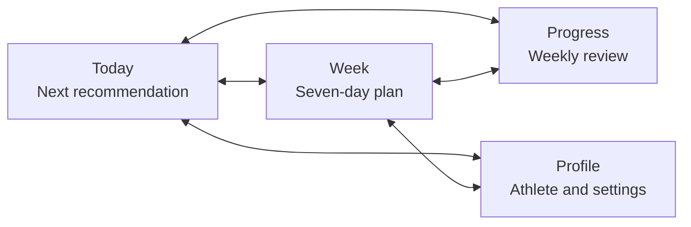
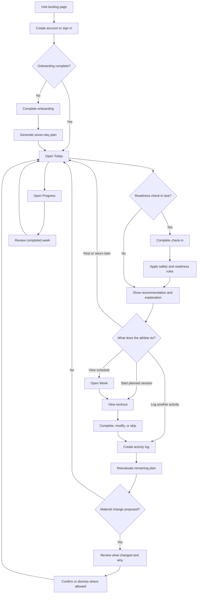
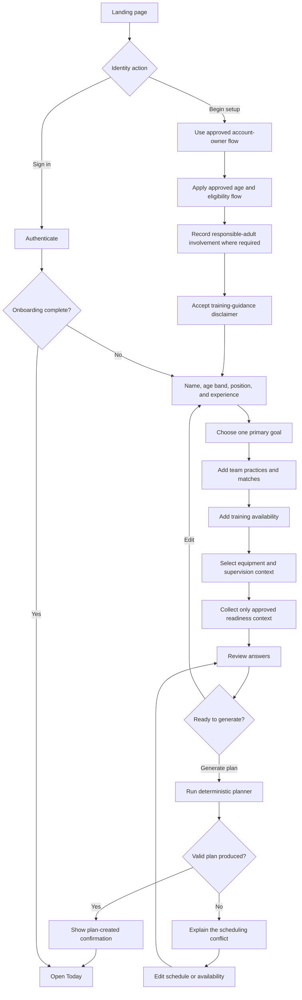
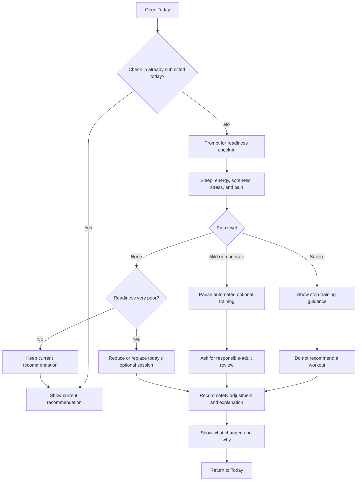
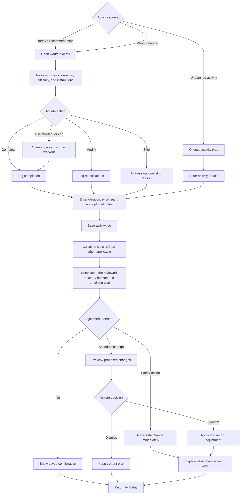
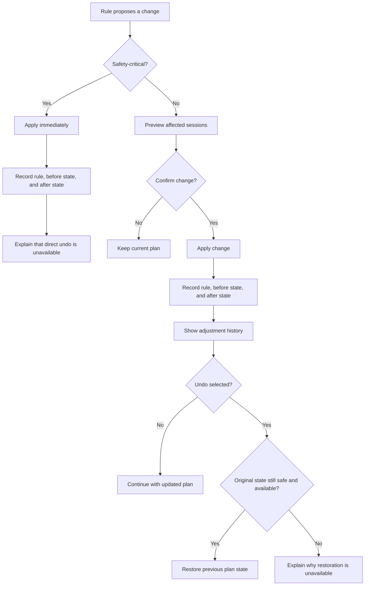
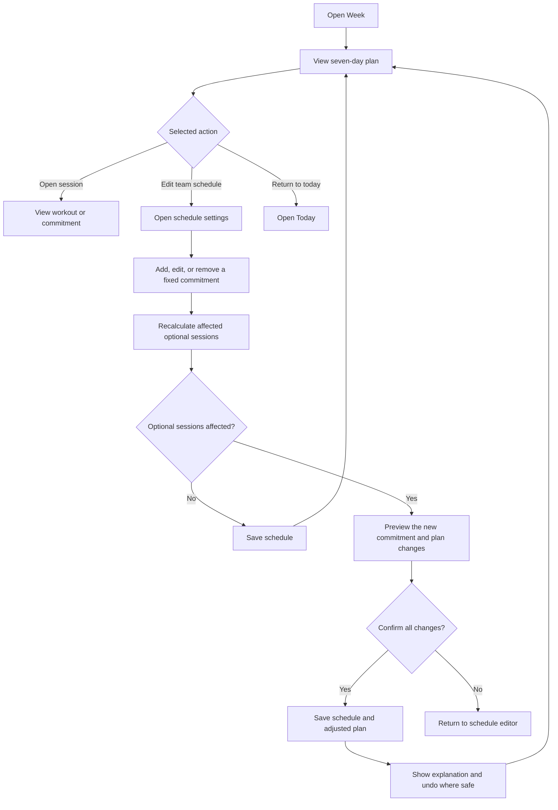
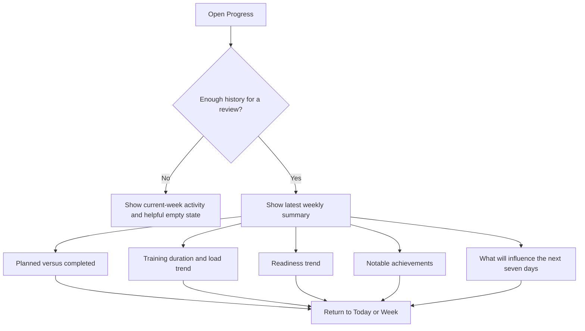
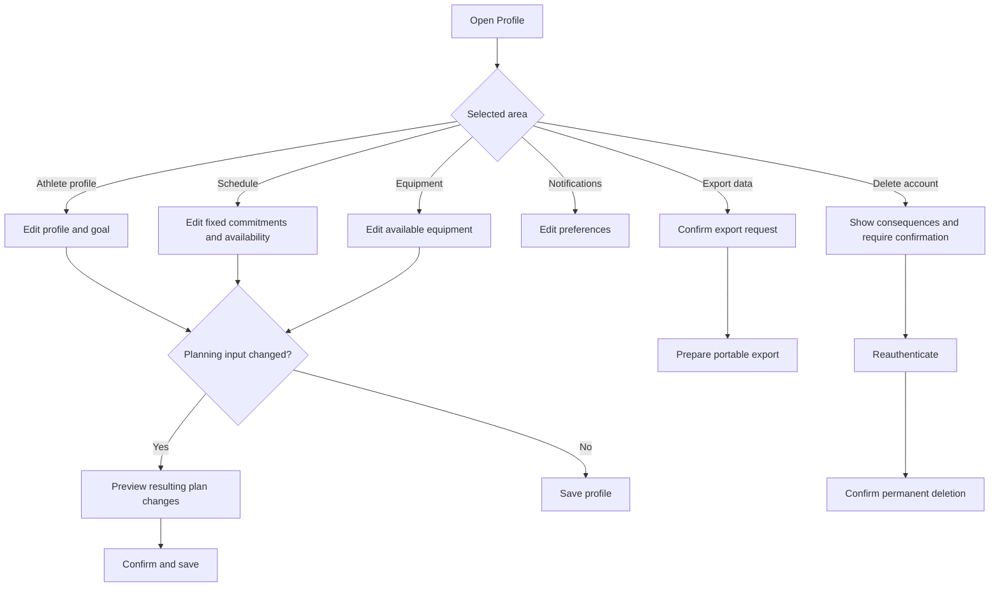

# PureAthletic V1 User Flow

**Status:** Target-product flow; not a current implementation map
**Last reviewed:** 24 August 2026
**Source:** [V1 Decision Sheet](decision-sheet.md)
**Scope:** Junior footballers in team age groups U5–U17, supported by a parent
or guardian, using the responsive web application

The first beta cohort, account owner, and consent model remain open. The active
prototype omits authentication and several target onboarding inputs. Use the
[Prototype Review](project-review.md) for current behavior and the
[Decision Sheet](decision-sheet.md) for decision status.

## 1. Flow objective

The core journey should help the athlete answer one question with as little friction as possible:

> What is the most appropriate thing for me to do next?

The complete V1 loop is:

`Onboard → generate plan → check readiness → train or rest → log activity → adjust plan → review progress`

## 2. Primary navigation

The application opens on **Today** after sign-in. Today owns the primary action; the other destinations provide context and account controls.

## 3. End-to-end journey

## 4. Account and onboarding

### Onboarding requirements

- The account-owner, age/eligibility, and consent flow is selected only after
  jurisdiction-specific privacy, legal, and safeguarding review.
- Progress is saved after each step.
- Back navigation preserves entered information.
- Structured inputs are sufficient; free-text notes remain optional.
- The athlete reviews all information before plan generation.
- A scheduling conflict is explained in plain language and never produces an unsafe fallback plan.

Availability, equipment, and qualified-supervision inputs describe the target
planner. They are deferred from current onboarding Step 4 until the rollout
gates in the Decision Sheet are met.

## 5. Today, readiness, and pain safety

### Safety behavior

- Safety actions occur immediately and cannot be bypassed with a simple undo.
- A later check-in may produce a new recommendation, but it does not erase the earlier safety record.
- Fixed team commitments remain visible; the product does not diagnose, provide return-to-play clearance, or move those commitments.
- Every pain response pauses automated optional training for responsible-adult
  review; severe pain additionally directs the athlete toward qualified support
  without claiming a diagnosis.

Exact thresholds and athlete-facing wording require practitioner review before the private beta.

## 6. Planned workout and activity logging

### Activity-log rules

- Completion status, actual duration, perceived exertion, and pain are structured fields.
- Notes and skip reasons are optional.
- An activity log may exist without a planned session.
- A planned session keeps its original identity after it is modified or skipped.
- Saving must be retry-safe so a failed connection does not create duplicate logs.

## 7. Plan adjustment and undo

Every adjustment view must answer:

1. What changed?
2. Why did it change?
3. Does the athlete need to confirm it?
4. Can it be undone?

## 8. Weekly calendar and schedule changes

Fixed commitments are visually distinct from optional sessions and are never moved by automatic adaptation.

## 9. Progress and weekly review

The first usable review appears after seven days of activity history. Progress emphasizes appropriate consistency, not maximum workload or daily training streaks.

## 10. Account and data controls

Account deletion must be deliberately confirmed and must not be presented as an ordinary one-click action.

Availability and equipment editing remain target-product flows and are not
currently active planning controls in the prototype.

## 11. Core screen inventory

| Screen | Primary job | Main exit |
| --- | --- | --- |
| Landing | Explain the product and start account creation | Sign up or sign in |
| Authentication | Create or access an account | Onboarding or Today |
| Onboarding | Collect the minimum valid planning inputs | Plan confirmation |
| Plan confirmation | Explain the generated seven-day plan | Today |
| Today | Make the next appropriate action obvious | Workout, check-in, Week, or activity log |
| Readiness check-in | Capture today's recovery and pain inputs | Updated Today recommendation |
| Week | Show the plan and fixed commitments in context | Session detail or schedule |
| Workout detail | Make an independent session executable | Activity log |
| Activity log | Record planned or unplanned activity | Adjustment result or Today |
| Adjustment review | Explain and confirm a plan change | Updated Today or Week |
| Progress | Summarize the completed week and useful trends | Today or Week |
| Profile and settings | Maintain planning inputs and account controls | Updated plan or Profile |

## 12. Wireframe acceptance checklist

The low-fidelity wireframes are ready for review when:

- A new eligible athlete can reach their first plan without an unexplained branch.
- The Today screen has one unmistakable primary recommendation.
- Readiness and activity logging can each be completed in under one minute.
- No pain path leads directly to an automated optional workout recommendation.
- Planned, fixed, completed, modified, skipped, recovery, and rest states are distinguishable without relying on color alone.
- Any proposed plan change explains what changed and why.
- Confirmation and undo behavior match the safety boundary.
- A user can reach schedule editing, data export, and account deletion from Profile.
- Mobile back navigation never loses completed onboarding or logging data.

## 13. Questions to test with low-fidelity wireframes

- Does a rolling today-plus-six-days view feel clearer than a Monday-to-Sunday week?
- Should readiness appear directly on Today or as a focused full-screen step?
- Can athletes distinguish a team commitment from a PureAthletic recommendation immediately?
- Is the difference between modifying a workout and logging an unplanned activity clear?
- Do adjustment explanations provide enough confidence without adding too much text?
- Is “planned sessions completed or appropriately modified” a motivating progress measure?
